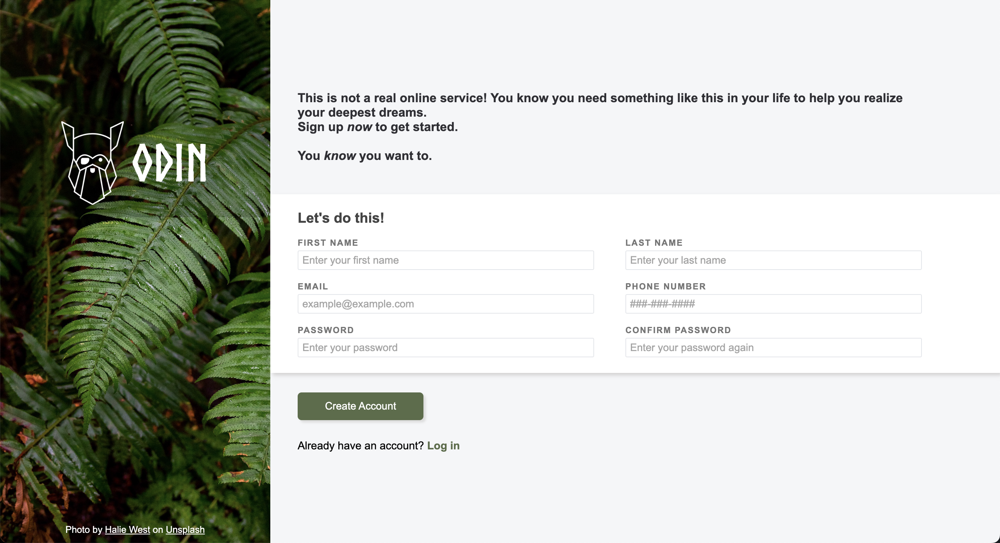

# The Odin Project - Project: Sign-Up Form

## Description
A sign-up form page written in HTML, CSS, and JavaScript for the sign-up form project in [The Odin Project](https://www.theodinproject.com/).
The purpose of this project is to practice making a form page. More features may be added in the future.
You can also try the project yourself [here](https://www.theodinproject.com/lessons/node-path-intermediate-html-and-css-sign-up-form)!

## Project Preview
### Screenshot

### Preview
You can also preview the page [here](https://tiffanychan614.github.io/odin-sign-up-form/).

## Skills
- Basic HTML
- HTML form
- Basic CSS
- CSS flexbox

## Features
This is a form that checks for:

- Any value for first and last name
- A valid email address(example@example.com)
- A 10-digit phone number in the format of ###-###-#### / ### ### #### / ##########
- A password that contains 8 or more characters that are of at least one number, and one uppercase and lowercase letter
- A password confirmation that matches the password

## What I Learned in this Project
- To create a basic form in HTML
- To style a form with CSS
- To use image as background
- To use regular expression in client-side data validation
- To check form values using JavaScript
- To write a README file

## Challenges
### 1. To style the pseudo classes of input text field

I learned that some browsers have a default outline for these classes that covers the border.
In order to show the change in border colours corresponding to different pseudo classes,
I have to set `outline: none;` for the target classes.

### 2. To manipulate styling using Javascript

I use JavaScript to add an error class to `#pwd` and `#confirm-pwd` whenever their values do not match
and added some styling to the error class in CSS, but it did not work.
Then I found out the styling I added to the error class is overridden by the previous styling because of CSS specificity. My initial solution is to add `!important` after each property/value pairs. But since it is considered to be a bad practice, I change the selector from `.error` to `input[type="password"].error` to increase its specificity.

### 3. To write a README file

Although I have completed several small projects before, I have never written any README file. I find it very difficult to decide what to include. Also, I don't know anything about a markdown file so it is quite a hard time for me to learn the syntax and format.

## Things to Improve / Add
-  More input fields involving different types of input
-  Set restrictions on the password format (Finished on 3/11)

## Credits
### Images
Halie West (https://www.haliewestphotography.com/)

### Project Ideas
The Odin Project (https://www.theodinproject.com/)
